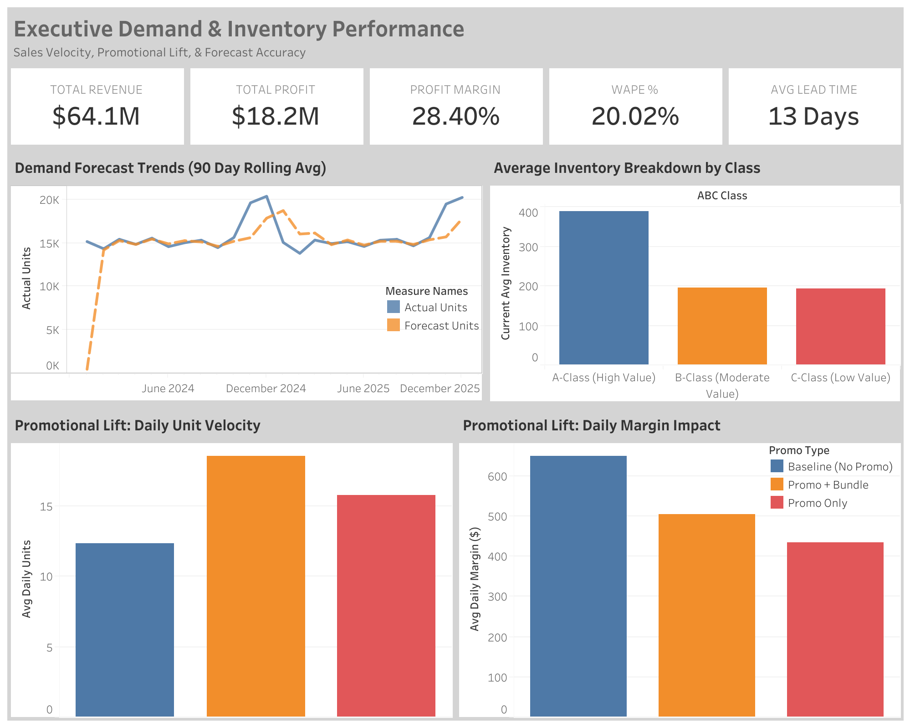

# Executive Demand & Inventory Performance Dashboard



## 📌 Executive Summary
This project delivers an end-to-end data pipeline and interactive Tableau dashboard designed to optimize supply chain inventory, track promotional lift, and evaluate forecast accuracy ($WAPE$). 

### Key Business Insights:
* **Promotional Trade-offs:** While bundling increases daily unit velocity by **+52%**, daily gross profit margin drops due to steep discounting—highlighting the need for target promo caps.
* **Forecast Accuracy:** Achieved a **20.02% WAPE** across 90-day rolling demand trends.
* **Inventory Allocation:** Over 60% of working capital is currently locked in Class-A inventory, ensuring stock availability for core revenue drivers.

---

## 🛠️ Tools & Tech Stack
* **Dashboard / Visualization:** Tableau Desktop / Tableau Public
* **Data Transformation & Aggregation:** Python (`pandas`, `numpy`), Jupyter Notebooks, SQL
* **Data Sources:** Daily Sales Forecast, Promotional Performance, SKU Inventory Health

---

## 📂 Repository Structure
```text
├── Data/              # Cleaned & processed datasets
├── Images/            # Screenshots and visual assets for documentation
├── Notebooks/         # Data cleaning & metric calculation notebooks
├── Scripts/           # Python/SQL data processing scripts
├── Tableau/           # Tableau Packaged Workbook (.twbx)
└── README.md          # Project documentation
```

---

## 🔗 Live Interactive Dashboard
👉 [Click here to view the interactive dashboard on Tableau Public](https://public.tableau.com/views/Supply_Chain_Inventory_management/Dashboard1?:language=en-US&:sid=&:redirect=auth&:display_count=n&:origin=viz_share_link)
